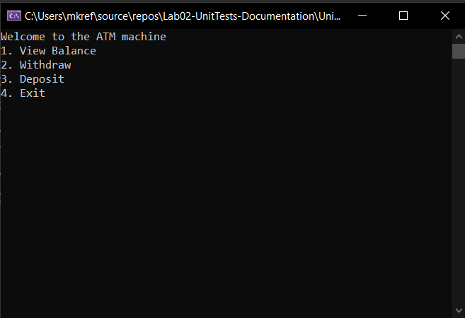
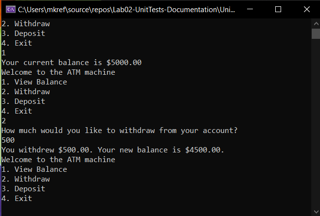
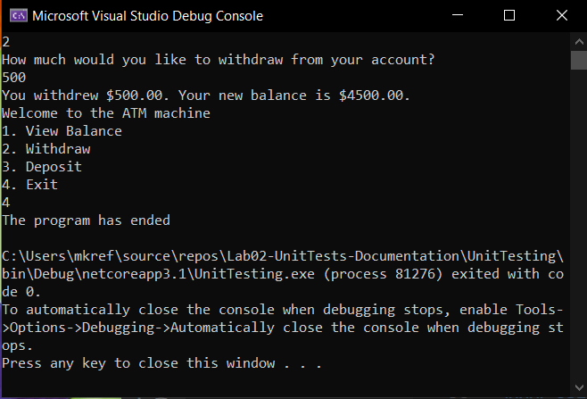

## Bank ATM Program

Lab02-UnitTests-Documentation

*Author: Michael Refvem*

----

## Description
This is a C# console application that mocks the functionality of an ATM machine. User interacts with the interface to view their balance, withdraw money and deposit money.
ATM game ends when user selects the "exit".

---

### Getting Started
Clone this repository to your local machine.

```
$ git clone https://github.com/MRefvem/Lab02-UnitTests-Documentation.git
```

### To run the program from Visual Studio:
Select ```File``` -> ```Open``` -> ```Project/Solution```

Next navigate to the location you cloned the Repository.

Double click on the ```Lab02-UnitTests-Documentation``` directory.

Then select and open ```UnitTests.sln```

---

### Visuals
***[Add screenshots of your application in action]***

#### Application Start

#### Using the Application

#### Application End


---

### Change Log
***[The change log will list any changes made to the code base. This includes any changes from TA/Instructor feedback]***  
1.3: *Added summary comments to the methods* - 8 Nov 2010  
1.2: *Changed variable names to follow proper convention* - 6 Nov 2010  
1.1: *Added a Try/Catch/Finally for Question 2* - 5 Nov 2010  


------------------------------
For more information on Markdown: https://www.markdownguide.org/cheat-sheet